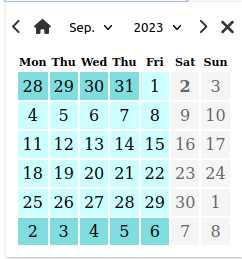

# React DateTimePicker

[](https://travis-ci.org/joemccann/dillinger)


## Features

- Select Date / Time / Datetime
- Customize default Date
- Disable Days / Dates / Times
- Disabled Times for specifics Dates
- Set Min & Max avaiable Date / Time

## Installation

```sh
npm install @milonte/datetimepicker
```

## How to use

```React
<DateTimePicker />
```

## Props

### type

Define type of Picker.

Type | Default Value | Required
------------- | ------------- | -------------
string | 'date' | no

Accepted values | Image
------------- | -------------
'date' | 
'time' | IMG
'datetime' | 

```jsx
<DateTimePicker type={'datetime'} />
```

### defaultDate

Set the default selected date of picker

Type | Default Value | Required
------------- | ------------- | -------------
Date | Date('now') | no

```jsx
<DateTimePicker defaultDate={ new Date() } />
```

### minDate, maxDate

Set the minimim / maximum avaiable date

Prop | Type | Default Value | Required
------------- | ------------- | ------------- | -------------
minDate | Date | Date('now') - 100y | no
maxDate | Date | Date('now') + 100y | no

```jsx
<DateTimePicker
    minDate={ new Date() }
    maxDate={ new Date() }
/>
```

### disabledWeekDays

Disabled specifics days of week, from Monday (0) to Sunday (6)

Type | Default Value | Required
------------- | ------------- | -------------
number[] | [] | no

```jsx
<DateTimePicker
    // Disable Saturday and Sunday
    disabledWeekDays={[5, 6]}
/>
```



### reservedDates

Disabled specifics Dates

Type | Default Value | Required
------------- | ------------- | -------------
string[] | [] | no

```jsx
<DateTimePicker
    reservedDates={[
        '25/08/2023', '28/09/2023'
    ]}
/>
```


### reservedDatesTimes

Disabled specifics Times at specifics Dates

***note:*** Only on type 'datetime' picker

Type | Default Value | Required
------------- | ------------- | -------------
Record<string, string[]> |  | no

```jsx
<DateTimePicker
    type='datetime'
    reservedDatesTimes={{
        '25/08/2023': ['10:30'],
        '28/08/2023': ['10:30', '11:00', '11:30']
         }}
/>
```


### minDayHour, maxDayHour

Set the minimum / maximum Hour avaiable

Prop | Type | Default Value | Required
------------- | ------------- | ------------- | -------------
minDayHour | string | '00:00' | no
maxDayHour | string | '23:59' | no

```jsx
<DateTimePicker
    minDayHour='10:15'
    maxDayHour='14:25'
/>
```

IMG

### hourStep

Set hour step increment

Type | Default Value | Required
------------- | ------------- | -------------
number | 15 | no

```jsx
<DateTimePicker
    // Avaiable hours = 00:00, 00:10, 00:20; etc
    hourStep={10}
/>
```

## Functions

### onUpdateDate

Return selected Date value (as Date type) on update Date

```jsx
<DateTimePicker 
    onUpdatedDate={(date) => { 
        console.log(date)
        // output: Date Fri Aug 18 2023 00:00:00 GMT+0200 (heure d’été d’Europe centrale)
    }}
/>
```

### Working with Form

If you want to use the DateTimePicker inside a form, you need to update the input attributes

```jsx
<form action="#" id="create-employee">
    <label htmlFor="first-name">First Name</label>
    <input type="text" id="first-name" name='first-name'
    required minLength={2} form='create-employee' />

    <label htmlFor="last-name">Last Name</label>
    <input type="text" id="last-name" name='last-name'
    required minLength={2} form='create-employee' />

    <label htmlFor="date-of-birth">Date of Birth</label>
    <DateTimePicker inputNodes= {{
        id: 'date-of-birth',
        name: 'date-of-birth',
        form: 'create-employee',
        required: true
    }}
    />
</form>
```
